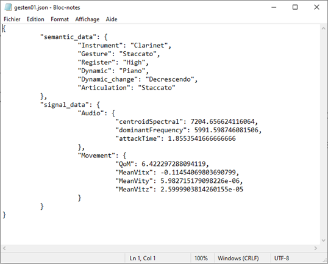
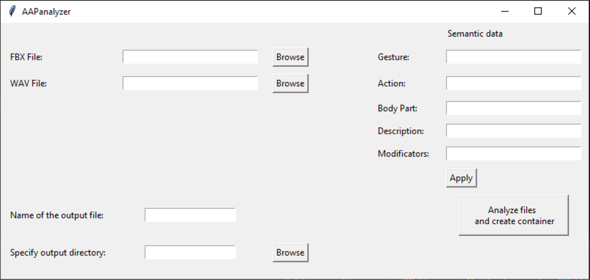
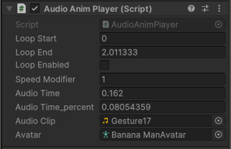

## Intership - Musical Gesture and Motion Capture
### PRISM Laboratory, Marseille

#### Workflow 

We recorded in a studio various instrument players. Concerning motion capture, we used Move.ai recommended workflow using 6 GoPros Hero 10 and professional lighting. For the audio, we used Oktava Mk12 microphones. 
Move.ai processes all video files and gives us an ```.fbx``` file containing a default animated model. I imported both ```.fbx``` and ```.wav``` files to crop them to the same length using Blender so I can then put them in the AAPanalyzer software. We fill in the semantic data and export the ```.aap``` file.  
  
Before concatenating files, we analyze audio and movement descriptors. For audio, we mainly used the attack time and the spectral centroid. For movement, we created a "Quantity of Movement" descriptor which which quantifies the acceleration of a specific bone in the model, reflecting it's movement intensity. We store these data in the ```.json``` file in the signal data category. They can be used to classify gestures.

  

For practical reasons, we decided to create a custom ```.aap``` container. Indeed, after analysis, we found ourselves with three files (```.fbx```, ```.wav``` and ```.json```) for each musical gesture. This results in an increase in the number of files required per gesture, which can become difficult to maintain as the size of the database grows.  



#### Unity  

I've implemented Editor Scripts which allow us to import ```.aap``` files in a dedicated "CustomData" folder. We have 3 main functions in the Files Menu :

  - Read Files : Read binary ```.aap``` file and create ```.fbx``` and ```.wav``` assets in the dedicated data folder.
  - Extract Animations :  Extract the animation from all ```.fbx``` files in the data folder and create animation assets.
  - Create Animation Controller : Unity needs a specific asset called "Animation Controller" to read animations. This function create them and put the animation asset inside.

One of the main reasons for having a unique file for each gesture is that it guarantees all associated files will share the same name.  
We can now load a sound file in the AppManager game object and start the player. It will automaticaly recognize the corresponding animation controller and attach it to the specified model in the AppManager when we hit the start button.  

