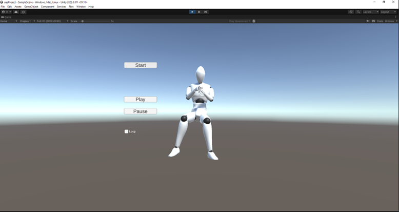

## Intership - Musical Gesture and Motion Capture
### PRISM Laboratory, Marseille

During my two-month internship at the PRISM Laboratory, I focused on the motion capture of musical gestures. My work centered on defining what constitutes a musical gesture and how these can be described. Using Move.ai technology, we created 3D models of musicians playing their instruments. The primary goal of the internship was to create a comprehensive database of gestures for analysis, composed of a 3D animation and its associated sound.

I developed a Python software that processes two files: an .fbx file for the animation and a .wav file for the sound. This software analyzes both files, resulting in a .aap file, which is a binary container holding both the animation and audio, and a .json file containing semantic and analytic data.

<table>
  <tr>
    <td></td>
    <td></td>
  </tr>
</table>
Additionally, I used Unity 3D to create a player/sequencer that synchronizes animations with audio. I developed a script that allows us to directly load .aap files and extract the assets from them.   
<table>
  <tr>
    <td></td>
    <td></td>
  </tr>
</table>
I created a scene with interactive UI elements, including basic player functionalities such as play/pause and loop. You can adjust the loop timings and playback speed through the game object's inspector.  

The goal of this project was to create a database of musical gestures and explore connections between audio and movement descriptors. Additionnaly, it was designed as a tool for musical creation, allowing samples to be searched using common data rather than just by instruments.

