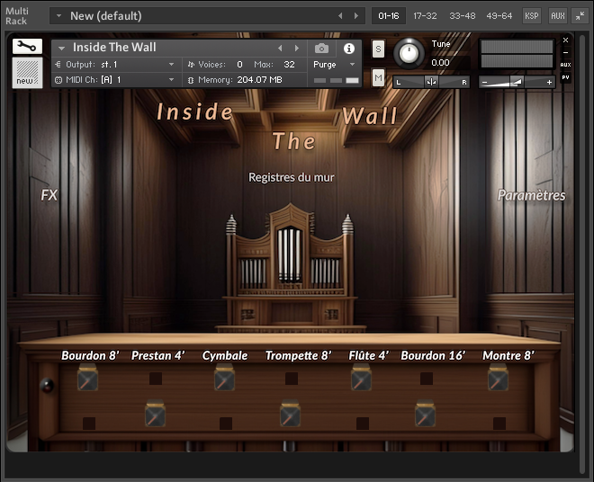

## Behind The Wall - Kontakt Organ Instrument

Behind The Wall is an Organ Kontakt Instrument. All samples are recorded from the organ at Grignan Temple in Marseille.

Various FX and parameters are accessible to play with including white noise and touch noise of keystroke.

Unfortunately, Inside The Wall is a two-weeks project so it's not a finished product and states are not saved between instances and upon closing.
