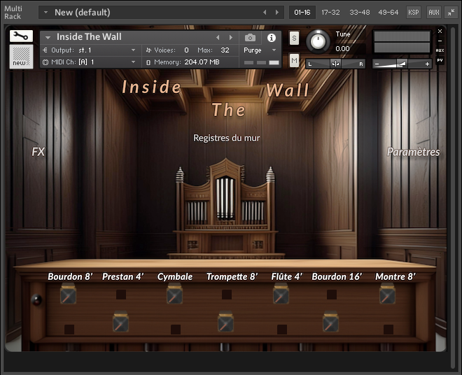

# studies-work
### _All my various projects gathered in one place_

## Intership - Musical Gesture and Motion Capture
### PRISM Laboratory, Marseille

During my two-month internship at the PRISM Laboratory, I focused on the motion capture of musical gestures. My work centered on defining what constitutes a musical gesture and how these can be described. Using Move.ai technology, we created 3D models of musicians playing their instruments. The primary goal of the internship was to create a comprehensive database of gestures for analysis, composed of a 3D animation and its associated sound.

I developed a Python software that processes two files: an .fbx file for the animation and a .wav file for the sound. This software analyzes both files, resulting in a .aap file, which is a binary container holding both the animation and audio, and a .json file containing semantic and analytic data.

Additionally, I used Unity 3D to create a player/sequencer that synchronizes animations with audio. I developed a script that allows us to directly load .aap files and extract the assets from them. This project allowed me to enhance my programming skills, deepen my knowledge of databases, and contribute to innovative research in the field of musical gestures and motion analysis.  
-> Rajouter le but de fin du projet à développer.

## Personnal project :
### Microtone - _Microtonal MIDI tuner_
Microtone's goal is to open microtonality to anyone who wants to explore new sounds with a simple tool. You can play with it using a regular MIDI piano and your favorite synth VST.

Achieve new harmonies, use uncommon scales and try bringing microtonality in your music.

***- Features :***
- Select a microtonal scale and a root key. Microtone remaps inputs with according pitch starting from the root key note using pitchwheel messages through MPE.
- Scale circle showing the repartition of notes along the scale.
- Real-time visualization of notes played (key and cents variations).

***- Planned :***
- Custom scale creation.
- MIDI visual arpeggiator using the scale circle.
- Microtonal notations
- Better UI 

## Master 1 : 

1. **openFrameworks** - _(C++)_
   
    - Little project as an introduction to openFrameworks. It's a simple flanger using a ring buffer. I added my personnal touch with a fun interface just to explore a bit more concerning graphics.

2. **Nightmares**  
_- Sound Design, FMOD Integration, Musical Composition_
    - One-week project using FMOD Studio. I had to create all sounds and compose a music according to my vision of the project.

***[Nightmares demo video](https://youtu.be/17RsxzRhjLo)***

3. **Celeste**  
_- Sound Design, FMOD Integration, Musical Composition_
    - Two-weeks project working in pairs. Every sound in the prologue is originally composed except for the dialogue.

***[Celeste Prologue demo video](https://youtu.be/uj4BmEaQM3w)***

4. **Organ Kontakt Instrument - _Inside The Wall_**  
    - Two-weeks prototype of an organ instrument for Kontakt. Samples were recorded from the historic organ at Grignan Temple in Marseille.

## Master 2 :

1. **JUCE - Delay VST**
    - First steps with JUCE framework.

